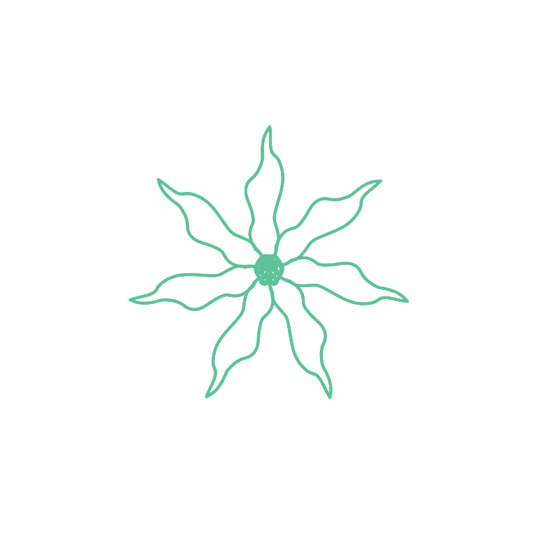
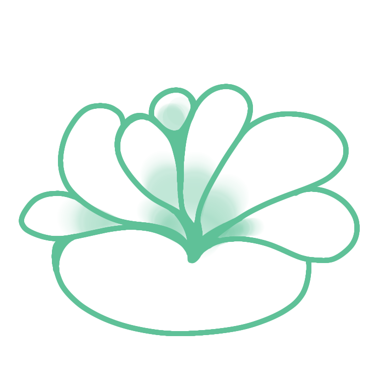
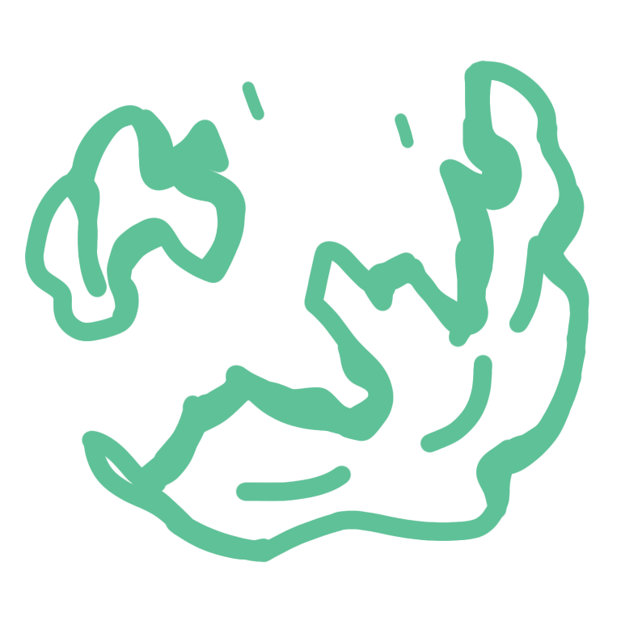
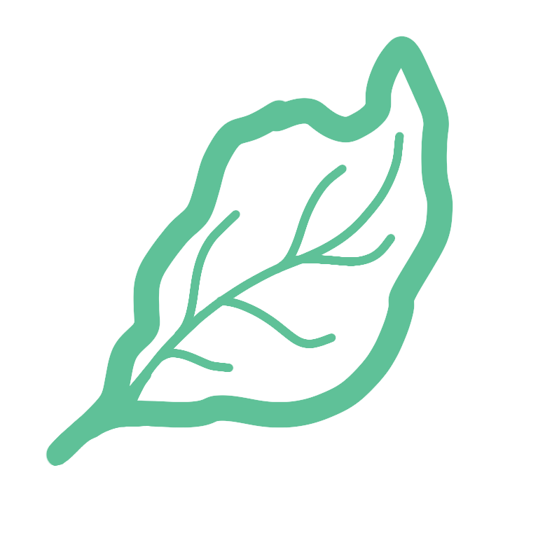
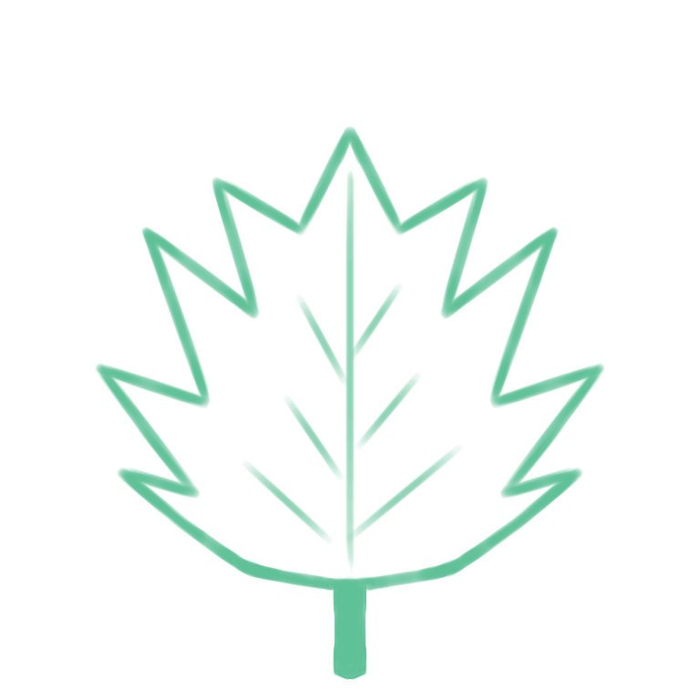
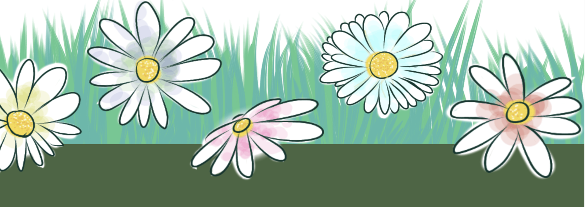

# Details

This section covers the designs used in the web's UI mostly 😅.

## Quick Summary

* [Background designs](#background-designs)

  * [Flower Pattern](#1-flower-pattern)
  * [Lotus Nakashi](#2-lotus-nakashi)
  * [Fluid Pattern](#3-fluid-pattern)
  * [Leaf Patterns](#4-leaf-patterns)
  
* [Tree Sketch](#tree-sketch)

* [Footer design](#footer-design)

* [Duration of project](#duration-of-the-project)

## Background designs

The different kinds of patterns are stacked repeatedly in different directions to form the entire background. These all are as follows:

### 1. Flower Pattern

This pattern is **inspired by the Crape Jasmine flower**, which is quite common in South Asia. It is white in color and odorless during the day. Its petals are usually narrow and slightly wavy, looking like a twisting star or pinwheel. They usually bud from a very young age and can bloom sporadically throughout the entire year, especially during the monsoons. Mostly, these are found in parks, gardens, and near roadsides as a natural decoration.

### 2. Lotus Nakashi

This design is inspired by the famous wooden sculpture style referred to as 'Nakashi' from India. These are mostly different kinds of patterns carved into wooden blocks for decorative purposes. Nakashis are usually found on doors, Hindustani beds, boxes, chairs, sofas, etc.

This pattern is specifically inspired by the lotus-shaped patterns usually carved on the very top of beds.

***(This is the pattern where the svg converters are turning soft blurred colors into solid blocks TwT)***

### 3. Fluid Pattern

This pattern is inspired by the fluid flow of water in an asymmetric shape.

### 4. Leaf Patterns

The two kinds of leaf patterns refer to common leaf shapes that are usually found everywhere.

## Tree Sketch

This tree sketch is stacked together with different images layered to create an interactive animation. Especially the leaves, which are split into different layers to create a moving and fading look.

## Footer Design

The footer division is made of three layers put together. The flower layer is the topmost layer, giving an overflow look, followed by the grass and the solid footer box.

## Duration of the project

* **For designs:** 1 week

  * **Desgin** from scratch in **Ibis paint**.
  * **Penpot** was used in making **sample UI** design and also **stacking the background** patterns together to creating a repetitive look.

* **Coding:** 3 months
  * Learn ---> Forget ---> Google ---> YouTube ---> Ask AI ---> But code somehow.
  * Vibe Coding? What's that?... I haven't really gotten into tools like Claude or Cursor yet. For now, I mostly learn by asking regular AI chatbots questions. The approach varies wildly depending on my mood OwO.

----

**Thank Yow** 😂
