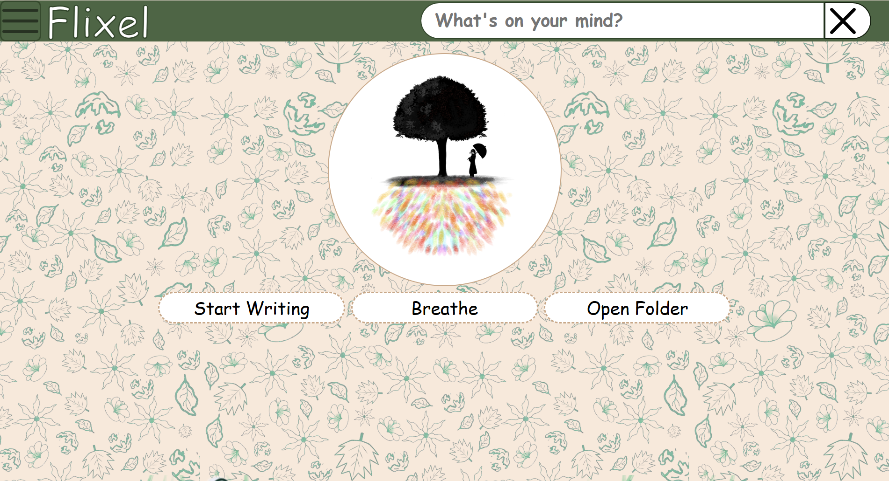

# Flixel

A personal diary web application designed with cozy patterns to provide a stress-free, comforting space for its users. Please note that while the frontend is fully functional, the backend is currently a work in progress to ensure user files and data are safely secured.

Link of the website:  [View Flixel Here](https://diksha-mukherjeeagarwal.github.io/Flixel/)

**(Please be patient as the website may take a moment to load)**

## 🛠️ Built With

This project was built using these technologies:

**Languages** - Vanilla HTML / CSS / JS

**Hosting/Deployment** - GitHub Pages

**Designing tools** - Penpot and Ibis Paint X

## ✨ Features

**Fully Responsive:** Optimized for desktop, tablet, and mobile.

**Low Eye fatigue:** The background and color palette are specifically designed to reduce eye fatigue.

**Mood-Based Quotes:** Generate random, mood-specific quotes by searching or clicking on your current emotional state.

**Read & Write:** Full support for reading and writing diary entries.

## 🚀 Getting Started

To get a local copy up and running, follow these simple steps.

1. Clone the repo:
`git clone https://github.com/Diksha-MukherjeeAgarwal/Flixel`

2. Navigate into the directory:
`cd Flixel`

3. **Install** the extension **live server** in VS Code to get a live view. **(Skip this if you already installed)**

4. Open the first page(index.html) and open live server in your browser. Alternatively, you can directly open live server and click on HTML folder instead.  

## 🔮 Future Commitments

**Secure Database:** Currently, the website stores data in the web browser's own JSON file. This means data can easily be erased via a single console command, making it vulnerable. Integrating a secure backend database to save and protect user files is a top priority.

**Optimized Web Images:** The current website uses WebP images for the background, SVG for icons, and PNGs for the rest. This can cause the site to load slowly on weaker internet connections. I plan to properly optimize and compress these images to improve response times.

*(Note: Because my background images feature soft overlay blur colors, current free SVG converters usually convert those soft blurs into solid blocks, which makes optimization tricky).*

**Edit Documents:** The website currently lacks an option to edit previous documents after they are created.

**AI Enhancements:** Future integration of an AI API to assist users in creating image stickers or enhancing their writing.

**Customization Features:** Adding features to change writing styles, adjust colors, add images, use pre-supplied or uploaded stickers, and change document styles to make the website even more user-friendly.

---

***For more details regarding the designs used, please refer to the [Details](details.md) document.***
